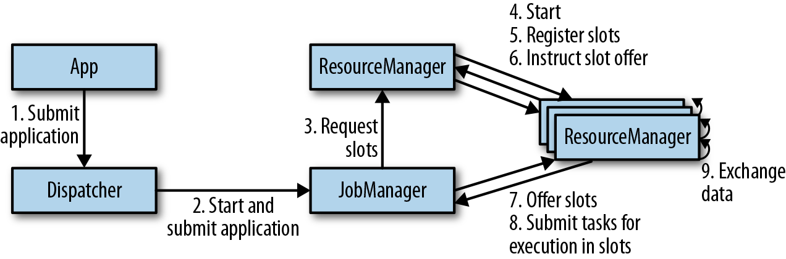
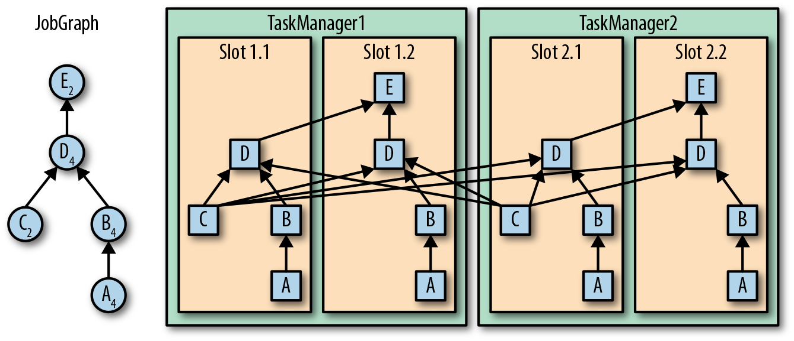
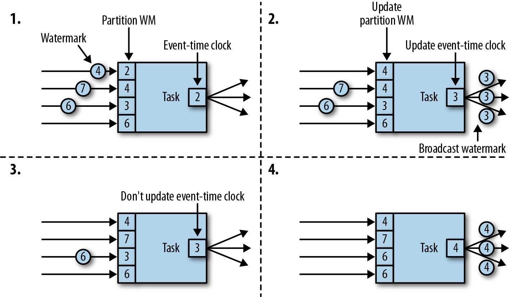

# 3. Apache Flink 架构

## 系统架构

* **架构概述**
  * 核心功能：分布式数据流处理
  * 集群管理器：Apache Mesos、YARN、Kurbernetes
  * 分布式存储：HDFS、S3
  * HA领导选举：ZooKeeper
* **搭建组件**
  * JobManager：单个应用程序的执行，JobGraph -> ExecutionGraph -> 申请 slot -> 检查点
  * ResourceManager：管理 TaskManager 中的 slots，管理申请和使用完的释放
  * TaskManager：工作进程包含多个线程，slots 作为资源进行分配
  * Dispatcher：接收提交的应用，启动 JobManager 对应这个应用

* **应用部署**
  * 框架模式：打包成 JAR 文件，通过客户端提交到运行的服务上
  * 库模式：绑定到应用所在的容器镜像中，常用于微服务架构
* **任务执行**

* **高可用性设置**
  * TaskManager 故障：JobManager 向 ResourceManager 申请更多的 slot
  * JobManager 故障：ZK 请求获取信息，向 ResourceManager 申请 slot，重启重置检查点

## Flink 中的数据传输

* TaskManager之间会有一个或者多个TCP连接
* 基于信用值的流量控制：缓冲合并发送数据
* 任务链接：降低本地通信开销（要求相同并行度）

## 事件时间处理

* 时间戳+水位线
  * 在数据源完成：SourceFunction
  * 周期分配器：AssignerWithPeriodicWatermarks
  * 定点分配器：AssignerWithPunctuatedWatermarks

## 状态管理

* 算子状态（operator state）：列表状态、联合列表状态、广播状态
* 键值分区状态（keyed state）：单值状态、列表状态、映射状态

## 检查点、保存点及状态恢复

* 一致性检查点：等待任务处理完所有的输入数据
* Flink 检查点：检查点分隔符（Chandy-Lamport 分布式快照算法）
* 保存点

