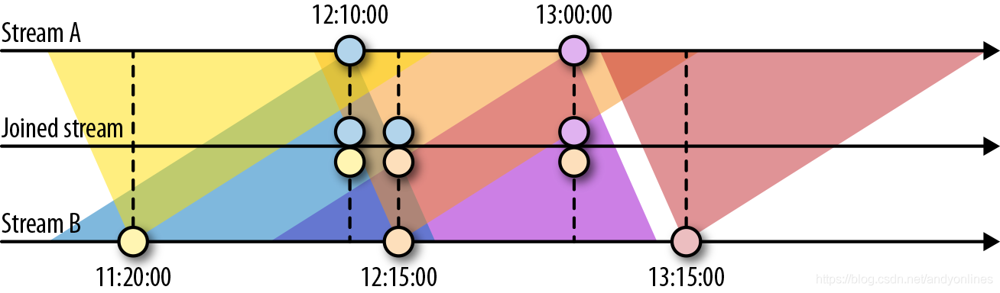

# 6. 基于时间和窗口的算子

## 配置时间特性

* StreamExecutionEnvironment
  * ProcessingTime：处理机器的系统时钟，极低延迟
  * EventTime：数据自身包含的信息（时间戳），处理乱序到达
  * IngestionTime：把在数据源算子的处理时间作为事件时间，并自动生成水位线
* 分配时间戳和生成水位线
  * 在数据源完成：SourceFunction
  * **周期分配器**：AssignerWithPeriodicWatermarks
    * 时间间隔：`ExecutionConfig.setAutoWatermarkInterval(default = 200ms)`
    * 如果 `getCurrentWatermark` 返回非空，且大于上一个水位线时间戳，就发出新水位线
    * `assignAscendingTimeStamps`：输入元素时间戳单调增加
    * `BoundedOutOfOrdernessTimeStampExtractor`：接受最大预期延迟
  * **定点分配器**：AssignerWithPunctuatedWatermarks
    * `extractTimestamp` -> `checkAndGetNextWatermark`
* 水位线：平衡延迟和结果的完整性

## 处理函数

* `ProcessFunction`, `KeyedProcessFunction`, `CoProcessFunction`, `ProcessJoinFunction`, `BroadcastProcessFunction`, `KeyedBroadcastProcessFunction`, `ProcessWindowFunction`, `ProcessAllWindowFunction`
* KeyedProcessFunction\[KEY, IN, OUT]
  * 实现 RichFunction：`open()`, `close()`, `getRuntimeContext()`
  * processElement(v: IN, ctx: Context, out: Collector\[OUT])
    * 每个记录都调用一次
    * 可以通过 Context 对象访问时间戳、当前记录的键值、TimerService
  * onTimer(timestamp: Long, ctx: Context, out: Collector\[OUT]
    * 回调函数，注册的计时器触发时被调用
* **时间服务和计时器 TimerService**
  * currentProcessingTime(): Long
  * currentWatermark(): Long
  * registerProcessingTimeTimer(timestamp: Long): Unit  // 处理时间计时器（机器时间）
  * registerEventTimeTimer(timestamp: Long): Unit            // 事件事件计时器（水位线）
  * deleteProcessingTimeTimer(timestamp: Long): Unit
  * deleteEventTimeTimer(timestamp: Long): Unit
  * 对于每个键值和时间戳，只能注册一个计时器
  * e.g. 如果某个传感器的温度在1秒内的处理时间内持续上升，则发出警告
* **向副输出发送数据 OutputTag\[X]**
  * e.g. 在遇到读数温度低于 32℉ 的记录，向副输出发送警告
* **CoProcessFunction**
  * e.g. sensor\_2 转发 10秒，sensor\_7 转发 1分钟

## 窗口算子

* **定义窗口算子**
  * 键值分区：stream.keyBy(...).window(...).reduce/aggregate/process(...)
  * 非键值分区（不支持并行）：stream.windowAll(...).reduce/aggregate/process(...)
* **内置窗口算子**
  * 滚动窗口（默认对齐，可以指定偏移量）
    * `.window(TumblingEventTimeWindows.of(Time.seconds(1)))`
    * `.window(TumblingProcessingTimeWindows.of(Time.seconds(1)))`
    * 简写：`.timeWindow(time.seconds(1))`
  * 滑动窗口（窗口大小、滑动间隔）
    * `.window(SlidingEventTimeWindows.of(Time.hours(1), Time.minutes(15)))`
    * `.window(SlidingProcessingTimeWindows.of(Time.hours(1), Time.minutes(15)))`
    * 简写：`.timeWindow(Time.hours(1), Time.minutes(15)))`
  * 会话窗口（非活动间隔）
    * `.window(EventTimeSessionWindows.withGap(Time.minutes(15)))`
    * `.window(ProcessingTimeSessionWindows.withGap(Time.minutes(15)))`
* **在窗口上应用函数**（增量/全量）
  * ReduceFunction：简单聚合，e.g. 最低温度
  * AggregateFunction：`createAccumulator`, `add`, `geResult`, `merge`， e.g. 平均温度
  * ProcessWindowFunction：**全量**元素复杂计算，e.g. 5秒滚动分组，计算最低温和最高温
    * process(key: KEY, ctx: Context, vals: Iterable\[IN], out: Collector\[OUT])
  * 增量聚合与 ProcessWindowFunction
    * Context 对象可以访问窗口的元数据或状态，可以连接在 Reduce/Process 后面
    * 窗口触发器触发时，传递给 process 的 Iterable.length == 1

```scala
input
    .keyBy(...)
    .timeWindow(...)
    .reduce(
        incrAggregator: ReduceFunction[IN} || AggregateFunction[IN, ACC, V],
        function: ProcessWindowFunction[IN, OUT, K, W]
    )
```

## 自定义窗口算子

* **窗口的生命周期**
  * 窗口创建：WindowAssigner 首次向它分配元素时
  * 窗口状态：窗口内容、窗口对象、触发器计时器、触发器中的自定义状态
  * 窗口删除：窗口结束时间到达时，需要清除自定义触发器状态（状态泄露）
* **窗口分配器**
  * WindowAssigner 将到来的元素分配给哪些窗口（0/1/n），e.g. 每30秒滚动窗口
  * MergingWindowAssigner：对已有窗口合并，例如 EventTimeSessionWindows 分配器
* **触发器** (optional)
  * 默认触发器：处理时间或水位线超过窗口结束边界时间
  * 提前触发：水位线到达结束时间戳前，计算，并发出早期结果（保守水位线+低延迟结果）
  * TriggerResult：`CONTINUE`, `FIRE`, `PURGE`, `FIRE_AND_PURGE`
* **移除器** (optional)：evictBefore, evictAfter
  * elements: Iterable, size: Int, window: W, context: EvictorContext

## 基于时间的双流 Join

* 基于间隔的 Join：相同键值 && 时间戳不超过指定间隔，e.g. `between(<lower-b>, <upper-b>)`
* 基于窗口的 Join：`input1.join(input2).where(p1).equalTo(p2).window(...).apply(...)`



## 处理迟到数据

* 丢弃迟到事件：default
* 重定向迟到事件：副输出重定向 -> 后续处理（如定期回填操作 backfill process）
* 基于迟到事件更新结果：延迟容忍度 `allowedLateness()`，根据状态标识 first / update
